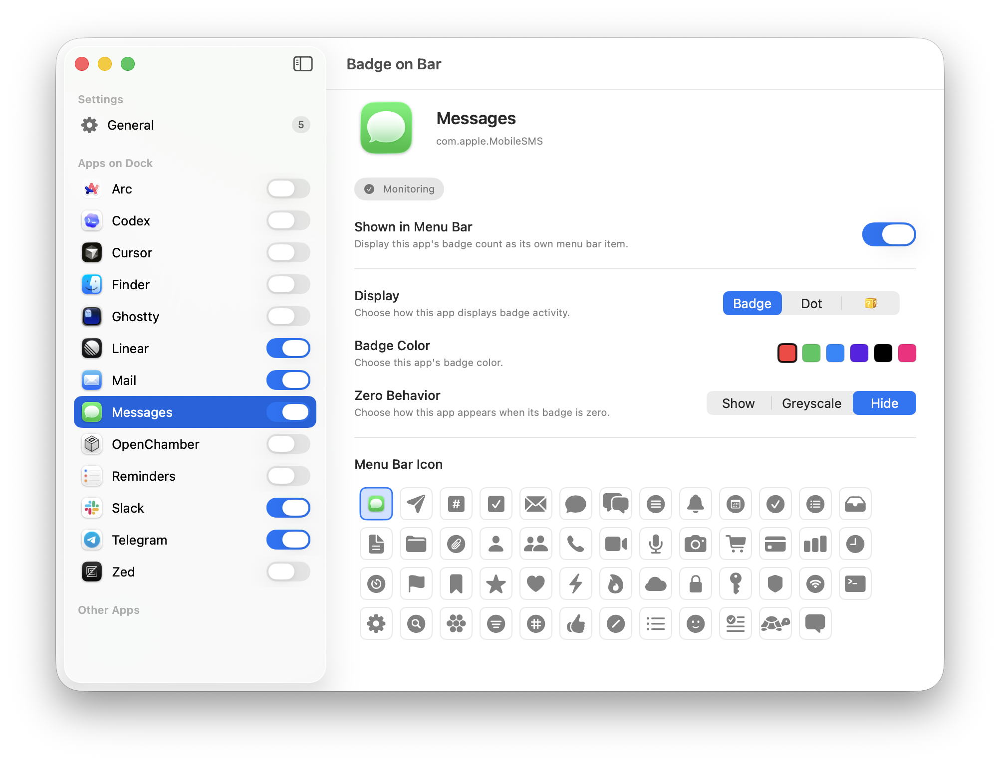

# Badge On Bar

Badge On Bar is a native macOS menu bar app that mirrors Dock badge counts into the menu bar.

  

Badge On Bar is a rewrite of the fantastic [Doll](https://github.com/xiaogdgenuine/Doll) project. It is built on [Code Moto](https://github.com/grahamotte/CodeMoto), a shared foundation for a Rails API, a React website, native Apple apps, and project tooling. This repository keeps its own Git history and configuration, and merges improvements from Code Moto as the foundation evolves. Components can be added or removed to suit the project.

## Contributing

Issues and PRs welcome.

Tools:

- `mise test` — run the complete app, web, deployment, and shared-gem test suite
- `mise simulate macos` — build and launch the macOS app
- `mise xcode` — open the Xcode project
- `$publish` — version, test, push, sign, notarize, and publish to GitHub Releases

## Local development

Install mise and PostgreSQL, and have PostgreSQL running locally. Apple app development and tests also require macOS with Xcode.

1. Run `mise install` to install the tool versions pinned in `mise.toml`.
2. Create `.env.development` and `.env.production` from `.env.default` and fill in the required values. Projects registered in Mr. Moto with 1Password references can generate them with Mr. Moto's `mise secrets <project>` instead.
3. Run `mise dependencies` to install project dependencies.
4. Run `mise db:migrate` to prepare the development database.
5. Run `mise start` to start the API, background jobs, and frontend sites. It prints the local URLs; the API runs at `http://localhost:3000`.

Non-secret project settings live in `config.json`, including the domain, GitHub repository, database name, subdomains, and app release details. Application credentials live in the gitignored `.env.*` files. Linear, GitHub/Forgejo PR operations, and macOS release uploads use Mr. Moto's central commands; repository-local tokens are not supported.

## Common commands

| Command | Purpose |
| --- | --- |
| `mise test` | Run all test suites, including frontend type checking |
| `mise tsc` | Type-check the frontend |
| `mise console` | Open the Rails development console |
| `mise simulate macos` | Build and launch the macOS app |
| `mise xcode` | Open the Apple app project |

Deployment, basis merges, and publishing use the project-specific instructions in [.agents/skills](.agents/skills). Mr. Moto owns card tracking, enqueueing, and the review workflow. Badge On Bar is distributed as a signed and notarized GitHub release, not through the App Store.

## What's included

- **Backend:** Ruby on Rails with PostgreSQL and GoodJob background jobs.
- **Frontend:** React, TypeScript, Vite, and Tailwind CSS, with separate sites for configured subdomains.
- **Apps:** A Swift macOS menu bar app, with simulator and signed GitHub release publishing tools.
- **Operations:** Server provisioning and deployment, backups, and shared Ruby gems.
- **Agent workflow:** Linear cards are worked by coding agents in Git worktrees, dispatched by the sister repository [Mr. Moto](https://github.com/grahamotte/MrMoto).

## Repository guide

| Directory | Contents |
| --- | --- |
| `backend/` | Rails API and background jobs |
| `frontend/` | React sites and shared frontend code |
| `apps/` | Native apps and screenshots |
| `gems/` | Shared Ruby libraries |
| `deploy/` | Infrastructure and deployment tooling |
| `publish/` | App versioning, simulation, and publishing |
| `manager/` | Project creation and Code Moto merges |
| `scripts/` | Scripts behind mise tasks |

See [manager](docs/manager.md) for how Code Moto works with Mr. Moto, [Apple credentials](docs/apple-credentials.md) for publishing setup, and [AGENTS.md](AGENTS.md) for contribution rules.

New Code Moto projects are created with `mise spawn` from the Code Moto repository. This app brings in foundation updates with the merge skill instead of replacing its history.

## License

MIT
